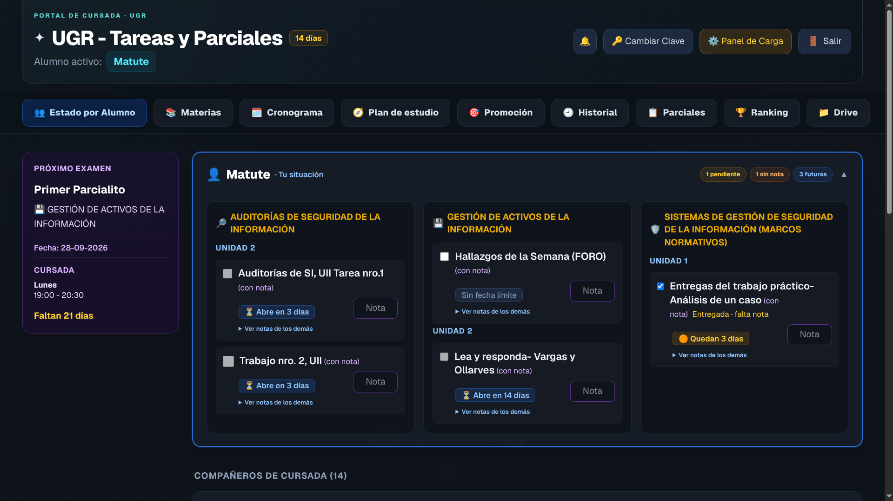
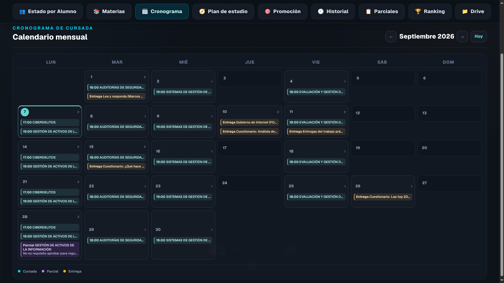
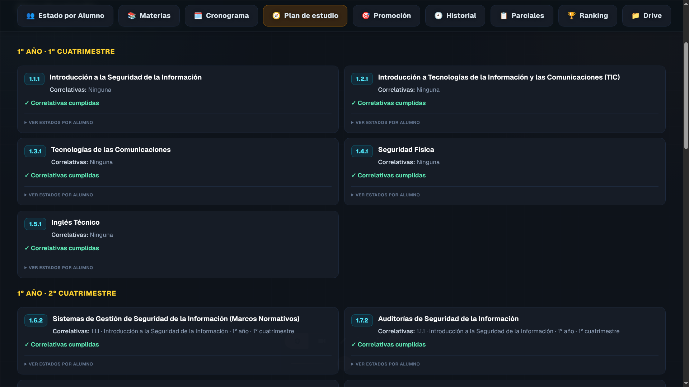
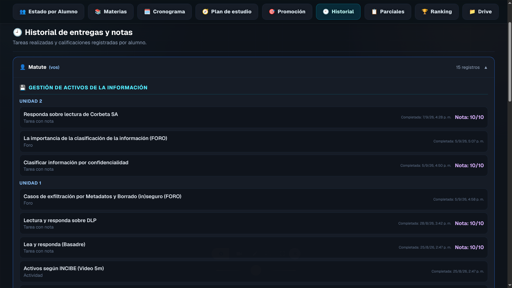
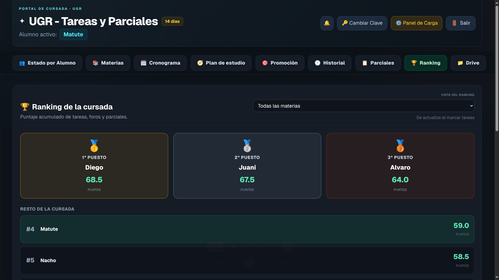

# Tareas UGR

Portal de gestión de cursada para un grupo de compañeros y amigos que quieren organizar la carrera sin perder tareas, fechas ni notas.

## ¿Qué es Tareas UGR?

Tareas UGR es una herramienta para acompañar la cursada de forma práctica y clara. La idea principal es centralizar todo lo importante de una comisión o grupo de estudiantes en un solo lugar: materias, tareas, entregas, parciales, horarios, notas, avances y comparaciones con el resto del grupo.

Es un proyecto pensado para uso real entre compañeros, no como una demo abstracta. La app nació para resolver un problema muy concreto: cuando cada uno guarda la información en distintos lados, es fácil perder una entrega, no enterarse de una fecha importante o no saber cómo viene el grupo.

## ¿Qué hace exactamente?

### Gestión de materias y tareas
- Crear y editar materias
- Organizar tareas por materia, unidad y tipo
- Definir fechas de inicio y fin
- Marcar qué tareas completó cada alumno
- Diferenciar tareas pendientes, entregadas, futuras y con nota faltante

### Estado personal y del grupo
- Ver el avance individual por alumno
- Consultar qué tareas faltan completar
- Revisar qué ya fue entregado y qué todavía necesita nota
- Mantener un historial de entregas y actividades por estudiante

### Parciales, notas y evaluaciones
- Registrar parciales por materia y fecha
- Cargar notas por alumno
- Mantener el seguimiento de evaluaciones y tareas con nota
- Ver el progreso y la evolución de cada materia

### Horarios y calendario
- Agregar horarios de cursada por materia y día
- Visualizar el calendario mensual del curso
- Ver fechas clave de tareas y parciales en un mismo espacio
- Tener una referencia rápida del cronograma académico

### Notificaciones y recordatorios
- Avisar sobre vencimientos cercanos
- Recordar tareas que se habilitan pronto
- Mostrar nuevas entregas o parciales cargados
- Mantener actualizados a los alumnos con lo más importante del curso

### Plan de estudio y comparación
- Rastrear el progreso del plan de estudios por alumno
- Ver estados de correlatividades y materias aprobadas o pendientes
- Comparar el avance del grupo
- Mostrar un ranking con puntaje por tareas, actividades y parciales

### Administración del curso
- Dar de alta alumnos
- Crear y modificar tareas, materias, horarios y parciales
- Actualizar datos del grupo desde un panel centralizado
- Mantener la información del curso ordenada y visible para todos

## Funcionalidades nuevas que lo hacen más útil

Además de la organización básica, la aplicación incluye herramientas que la vuelven mucho más completa para una comisión real:

- Ranking de la cursada con comparación entre compañeros
- Historial de entregas y notas por alumno
- Vista del plan de estudio con correlatividades y estados
- Calendario de tareas, parciales y entregas
- Sistema de notificaciones por vencimientos y fechas importantes
- Panel de administración para cargar contenido del curso
- Diferenciación clara entre actividades, tareas con nota, foros y evaluaciones

## Cómo se ve en la práctica

La app está pensada para que cada alumno pueda entrar y ver, de un vistazo:
- su situación actual
- qué tareas tiene pendientes
- qué materias o parciales están próximos
- cómo va comparado con sus compañeros
- qué actividades y notas ya quedaron registradas

También existe una vista para el admin que permite cargar todo el contenido del curso y mantenerlo actualizado.

## Capturas de la app

Las vistas principales del proyecto son estas:

### Estado del Alumno



### Cronograma



### Plan de Estudio



### Historial



### Ranking



## Estado del proyecto

Este proyecto ya está funcional y siendo utilizado por un grupo de compañeros y amigos para organizar la cursada de manera real. No es solo una maqueta ni un prototipo conceptual: es una herramienta práctica que se usa para seguir tareas, notas, fechas y progreso del curso en la vida diaria.

En otras palabras, el proyecto está en desarrollo activo, pero con una base sólida y con uso real en la práctica.

## Tecnologías

- [Next.js](https://nextjs.org/)
- React
- Tailwind CSS
- [Turso](https://turso.tech/) con libSQL
- Node.js

## Requisitos

- Node.js 20 o superior
- Base de datos compatible con Turso/libSQL
- Variables de entorno para la conexión a la base de datos y la sesión

## Para correrlo localmente (opcional)

Si querés probarlo en tu entorno local, lo más simple es:

1. Cloná el proyecto y entrá a la carpeta.
2. Instalá dependencias con npm install.
3. Copiá `.env.example` como `.env.local` y completá tus variables de entorno. `SESSION_SECRET` es obligatorio y no puede reutilizar el token de Turso.
4. Ejecutá `npm run migrate` para preparar o actualizar la base de datos (incluye hashear contraseñas que todavía estén en texto plano).
5. Ejecutá npm run dev y abrí la app en tu navegador.

Ejemplo de variables:

```env
TURSO_DATABASE_URL=tu_url_de_turso
TURSO_AUTH_TOKEN=tu_token_de_turso
SESSION_SECRET=una_clave_larga_y_secreta
```

## Scripts disponibles

```bash
npm run dev
npm run build
npm run start
npm run lint
npm run migrate
npm run ugr:login        # inicia sesión en UGR Virtual y guarda la sesión
npm run ugr:sync         # detecta tareas nuevas y sugiere agregarlas
npm run ugr:sync -- --dry   # solo mostrar (no escribe nada)
npm run ugr:sync -- --yes   # insertar todo sin preguntar
```

### Sincronización con UGR Virtual (campus Moodle)

Los scripts `ugr:login` y `ugr:sync` traen tareas nuevas desde `virtual.ugr.edu.ar` usando tu sesión (login clásico de Moodle, sin API pública). Resumen:

1. Agregá en `.env.local` (nunca en git):

   ```env
   UGRVIRTUAL_USER=tu_usuario
   UGRVIRTUAL_PASSWORD=tu_contrasena
   ```

2. `npm run ugr:login` guarda la sesión en `data/ugr-sesion.json` (no se commitea).
3. `npm run ugr:sync` mapea los cursos del campus contra tus materias locales, detecta las tareas que no están cargadas y pregunta antes de insertarlas.

   El mapeo de cursos es por **nombre literal**: los cursos de UGR Virtual se llaman igual que las materias del periodo, con un prefijo de versión tipo `(V.TUCS.1.07.2)` que el script ignora automáticamente. Si el campus sirve el nombre truncado en el listado, el sync abre la página del curso para recuperar el nombre completo.

   Por tarea se trae además la **unidad** (del índice, p. ej. «Unidad II») y la **fecha de apertura** (del detalle de la tarea, bloque «Apertura»/«Cierre»), así quedan cargadas como inicio/fin en la app.

4. En el panel también hay un botón **🔄 Sincronizar UGR** (visible solo para el admin, junto a «Panel de Carga»): abre una ventana con lo que encontró y, si está todo bien, se dan a «Cargar» para insertarlas sin tocar la terminal.

Toda la lógica vive en `src/lib/ugr/` (autenticación, parsers de Moodle y normalización) y está cubierta por tests en `tests/ugr/`. El núcleo compartido está en `src/lib/ugr/sync-core.mjs`.

> Nota: como el campus no habilita tokens de API para estudiantes, el script reutiliza la sesión HTTP (cookies de Moodle). Si Moodle cambia el HTML del índice de tareas, puede requerir un ajuste menor en los parsers.

## Motivación

La idea no es reemplazar plataformas universitarias ni crear una herramienta académica compleja. La intención es ayudar a un grupo de estudiantes a organizarse mejor, no perder fechas ni tareas, y tener la cursada clara y ordenada desde un solo lugar.

La parte del ranking funciona como motivación extra, pero la verdadera utilidad es que el grupo sepa en todo momento qué falta, qué viene, y cómo avanza la carrera en conjunto.

## En resumen

Tareas UGR es una app hecha para una comisión real de estudiantes que necesita un lugar central para organizar la cursada. Tiene gestión de tareas, notas, horarios, parciales, historial, plan de estudio y comparación entre compañeros, y ya está más allá de una versión básica: es una herramienta útil, funcional y pensada para ser usada todos los días.

