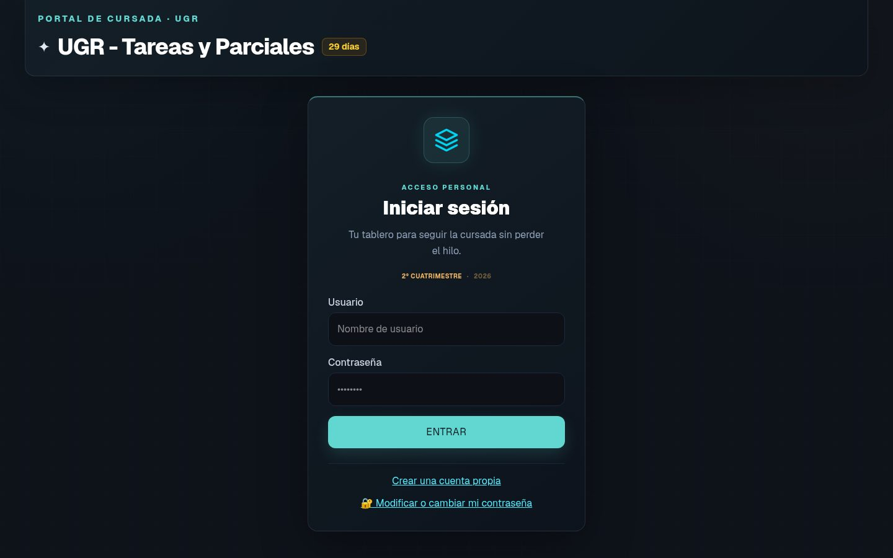
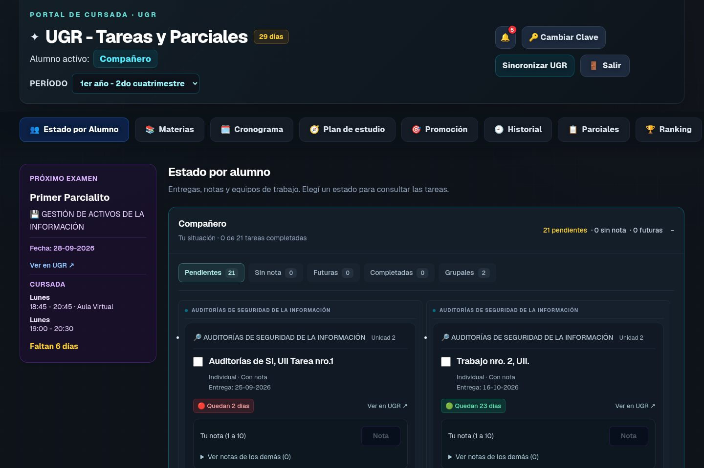
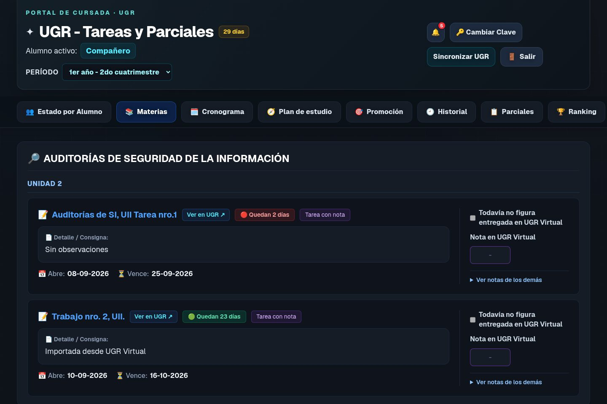
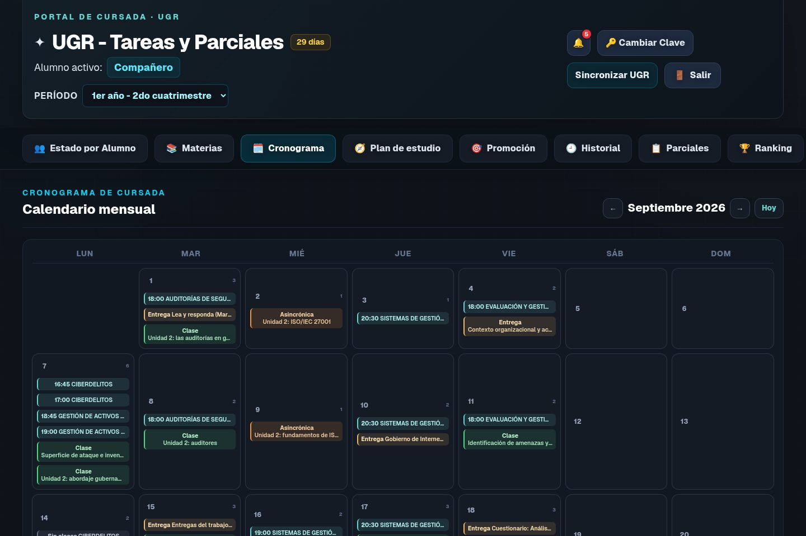
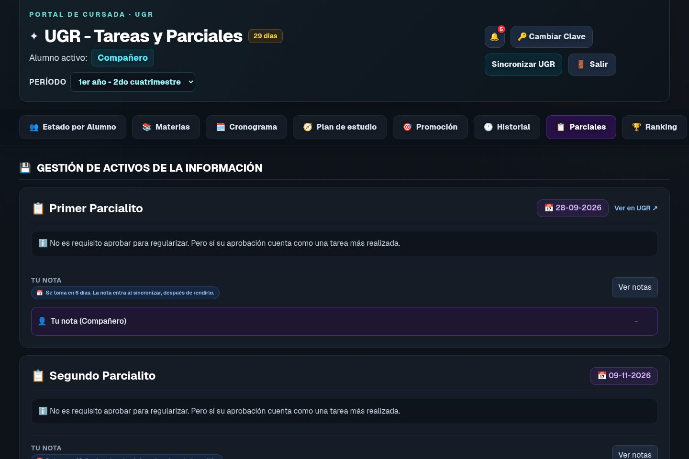
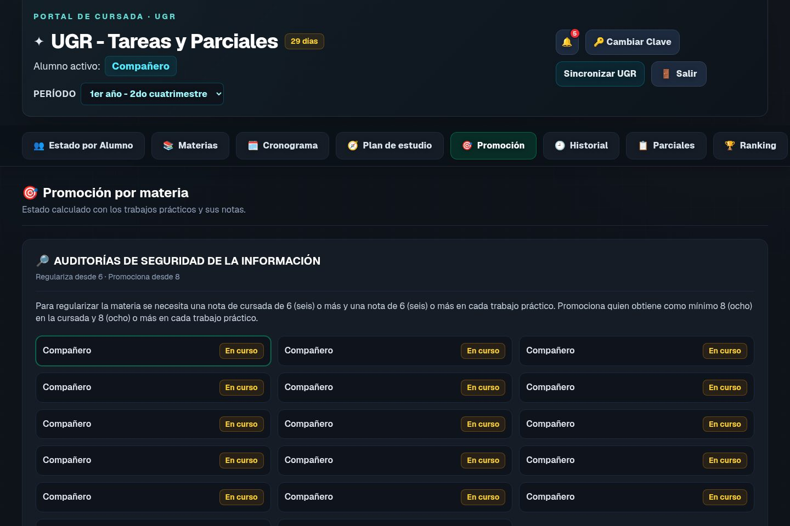
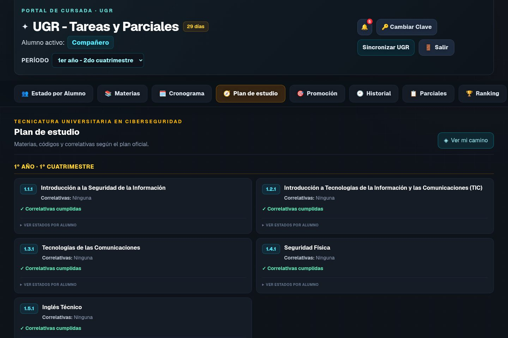

# UGR — Tareas y Parciales

La cursada de la Tecnicatura, junta en un solo lugar

UGR Virtual sigue siendo donde se entrega y donde la cátedra publica. Este tablero es donde se entiende el cuatrimestre: qué te falta, cuándo cursás, cuándo se toma el parcial, cómo venís para regularizar o promocionar, y qué te queda de la carrera.

## Para qué está

En la comisión el trabajo no es solo subir un archivo. Es saber, el mismo día y para todos:

- qué actividad está abierta, cuál vence esta semana y cuál todavía no se habilitó;
- quién entregó, a quién le falta la nota y quién quedó afuera de un grupo;
- si con las notas de hoy la materia se regulariza, se promociona o hay que rendir final;
- cuándo es el próximo parcial y en qué horario se cursa;
- qué materias de la carrera ya están aprobadas y cuáles se desbloquean después.

Eso hoy está repartido entre cursos, foros, calificaciones y el grupo de la comisión. Acá se lee de una vez.

## Tu situación, materia por materia

Entrá y lo primero que ves es lo tuyo: pendientes, entregas sin nota, actividades que todavía no abrieron, completadas y trabajos grupales. Al lado, el próximo examen y el horario de cursada.

Cada tarea muestra la materia, la unidad, cuándo abre, cuándo vence y un semáforo de los días que quedan. Desde la tarjeta se abre la consigna en UGR Virtual.

La entrega y la nota no se cargan a mano. Se copian del campus cuando sincronizás. Si el profesor alarga un plazo o corrige una fecha, la próxima sincronización deja la fecha nueva: el campus manda.

De un compañero se puede consultar el estado. La nota de otro no se escribe desde acá.

## El mes, en un calendario

Clases, entregas y parciales van al mismo mes. La campana avisa lo que vence, lo que se habilita mañana y los avisos de la cátedra que importan para la cursada.

## El parcial es un día

Si la actividad se llama parcial o evaluación, no es una tarea con apertura y cierre. Es un examen: se toma el día de cursada, en el horario de la clase. Hasta ese día la nota no existe. Después de rendirlo, la siguiente sincronización la trae del campus.

## Promoción, ranking y grupos

Cada materia tiene su regla: desde qué nota se regulariza, desde cuál se promociona, y si eso mira los trabajos prácticos. Se ve el estado de la comisión en esa materia, sin armar una planilla aparte.

El ranking es por materia: entran quienes la están cursando, con el puntaje de tareas, foros y parciales.

Si el trabajo es grupal, se arma el equipo en el tablero, con cupo si la consigna lo pide. La entrega y la nota valen para todo el grupo.

## La carrera, no solo este cuatrimestre

El plan de la tecnicatura está cargado con códigos y correlativas. Marcás lo que ya aprobaste o promocionaste y ves qué materias te quedan habilitadas. El historial guarda entregas y notas de períodos anteriores, sin mezclarlos con el actual.

## Cómo se entra

Cada alumno crea su usuario y su clave. En el alta se escribe también el DNI y la contraseña de UGR Virtual: el campus los comprueba en el momento y no quedan guardados en esta página.

Si UGR acepta, sincronizar dice a qué materias de la carrera estás inscripto, guarda esa cursada en el período actual y carga las tareas, el cronograma y los parciales que todavía no estaban. El compañero que sincroniza después se anota en las mismas materias y no duplica lo que ya está.

A partir de ahí, cada sincronización vuelve a mirar el campus: fechas nuevas, parciales y notas que la cátedra haya publicado.
